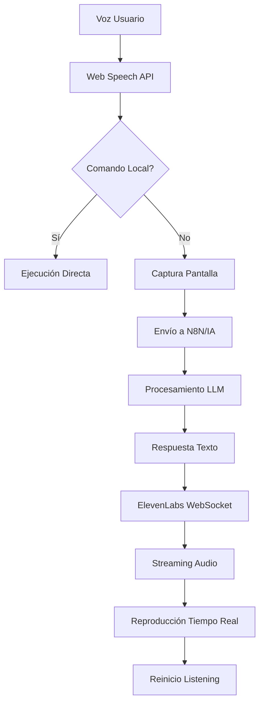

# 🤖 AI Extension - Asistente Web Inteligente

Una **extensión de navegador revolucionaria** que integra múltiples tecnologías de **Inteligencia Artificial** para crear un asistente web completamente autónomo con capacidades de **reconocimiento de voz en tiempo real**, **análisis visual avanzado** y **síntesis de voz streaming**.

## 🚀 Características Principales de IA

### 🎙️ **Reconocimiento de Voz Streaming en Tiempo Real**
- **Detección continua de voz** con WebRTC y Web Speech API
- **Procesamiento inmediato** de comandos sin necesidad de botones
- **Detección inteligente de pausas** para optimizar la respuesta
- **Calidad adaptativa** según la conexión de red
- **Filtros de ruido avanzados** con echoCancellation y noiseSuppression
- **Soporte multi-idioma** con preferencia español (es-ES)

### 🔊 **Síntesis de Voz con Streaming de Audio**
- **Integración nativa con ElevenLabs WebSocket** para audio en tiempo real
- **Reproducción instantánea** mediante chunks de audio streaming
- **Calidad de audio superior** con modelos eleven_multilingual_v2
- **Configuración dinámica** de velocidad, estabilidad y similitud
- **Detección automática de formato** (MP3/WAV/PCM)
- **Queue management inteligente** para múltiples respuestas

### 👁️ **Análisis Visual Avanzado**
- **Captura automática de pantalla** al activar comandos de voz
- **Procesamiento con IA visual** para contexto de la página
- **Detección de elementos UI** (formularios, botones, campos)
- **OCR integrado** para lectura de texto en imágenes
- **Análisis de layout** para navegación inteligente

### 🧠 **Procesamiento de Lenguaje Natural (NLP)**
- **Clasificación automática de comandos** (locales vs. IA)
- **Comprensión contextual** basada en el contenido visual
- **Ejecución de herramientas locales** para tareas comunes
- **Integración con modelos LLM** a través de N8N/OpenRouter
- **Memoria conversacional** persistente

## 🏗️ Arquitectura Técnica

### **Componentes de la Extensión**

```
┌─────────────────────────────────────────────────────────────┐
│                    AI Extension                              │
├─────────────────────┬─────────────────────┬─────────────────┤
│   Content Script    │   Background Script │   Popup Script  │
│   (content.js)      │   (background.js)   │   (popup.js)    │
├─────────────────────┼─────────────────────┼─────────────────┤
│ • Voice Recognition │ • WebSocket Manager │ • Control Panel │
│ • Visual Analysis   │ • API Orchestration │ • Configuration │
│ • UI Automation     │ • Audio Streaming   │ • Status Monitor│
│ • Widget Management │ • Tab Communication │ • Quick Actions │
└─────────────────────┴─────────────────────┴─────────────────┘
                              │
                    ┌─────────┴─────────┐
                    │   External APIs   │
                    │                   │
                    │ • N8N Webhook     │
                    │ • ElevenLabs WS   │
                    │ • Multimodal API  │
                    │ • ChromaDB        │
                    └───────────────────┘
```

### **Flujo de Procesamiento de IA**



## 🛠️ Tecnologías de IA Integradas

### **1. Web Speech API - Reconocimiento de Voz**
```javascript
// Configuración avanzada del reconocimiento
recognition = new SpeechRecognition();
recognition.lang = 'es-ES';
recognition.interimResults = true;
recognition.maxAlternatives = 1;
recognition.continuous = true;

// Configuración de audio optimizada
navigator.mediaDevices.getUserMedia({ 
  audio: {
    echoCancellation: true,
    noiseSuppression: true,
    autoGainControl: true,
    sampleRate: 44100
  } 
});
```

### **2. ElevenLabs WebSocket Streaming**
```javascript
// Conexión WebSocket para audio en tiempo real
const wsUrl = `wss://api.elevenlabs.io/v1/text-to-speech/${VOICE_ID}/stream-input?model_id=${MODEL_ID}`;
const ws = new WebSocket(wsUrl);

// Configuración de voz con IA
const bosMessage = {
  text: " ",
  voice_settings: {
    stability: 0.5,
    similarity_boost: 0.5,
    style: 0.0,
    use_speaker_boost: true
  },
  xi_api_key: ELEVENLABS_API_KEY
};
```

### **3. Chrome Extensions API - Captura Visual**
```javascript
// Captura de pantalla con contexto
chrome.tabs.captureVisibleTab(window.id, {
  format: 'jpeg', 
  quality: 70
}, function(dataUrl) {
  // Procesamiento con IA visual
  processImageWithAI(dataUrl);
});
```

## 📋 Funcionalidades Inteligentes

### **🎯 Comandos de Voz Avanzados**

#### **Herramientas Locales (Ejecución Instantánea)**
- `"Escribe [texto]"` - Autocompletado inteligente de formularios
- `"Selecciona [opción]"` - Navegación inteligente en dropdowns
- `"Siguiente campo"` - Movimiento automático entre campos
- `"Enviar formulario"` - Detección y envío automático
- `"Elimina espacios"` - Limpieza automática de campos

#### **Consultas con IA (Procesamiento Completo)**
- Preguntas contextuales sobre el contenido visual
- Análisis de documentos y formularios
- Sugerencias de autocompletado inteligente
- Explicaciones de interfaces complejas
- Asistencia en navegación web

### **🔄 Gestión Inteligente de Estado**

```javascript
// Sistema de colas para audio streaming
let audioStreamingQueue = [];
let isStreamingAudio = false;
let streamingCompletelyFinished = false;

// Calidad adaptativa de conexión
function updateConnectionQuality(responseTime) {
  if (responseTime < 3000) connectionQuality = 'fast';
  else if (responseTime < 8000) connectionQuality = 'medium';
  else connectionQuality = 'slow';
}
```

### **🎨 Interfaz Flotante Inteligente**

- **Widget arrastrable** con persistencia de posición
- **Indicadores visuales** de estado del procesamiento de IA
- **Ondas de audio animadas** durante síntesis de voz
- **Feedback en tiempo real** del reconocimiento de voz
- **Adaptación responsive** a diferentes resoluciones

## 🔧 Configuración y Instalación

### **Requisitos Técnicos**
- **Navegador**: Chrome/Edge/Brave (Manifest V3)
- **Permisos**: Micrófono, captura de pantallas, almacenamiento
- **APIs Externas**: ElevenLabs, N8N, OpenRouter
- **Conectividad**: WebSocket compatible

### **Instalación en Modo Desarrollador**

1. **Clonar y configurar**:
```bash
git clone https://github.com/leherreraSkillChallenge/AI-Extension.git
cd "AI Extension"
```

2. **Cargar en Chrome**:
   - Abrir `chrome://extensions/`
   - Activar "Modo de desarrollador"
   - Clic en "Cargar extensión sin empaquetar"
   - Seleccionar la carpeta `AI Extension`

3. **Configurar APIs**:
   - Obtener API key de ElevenLabs
   - Configurar webhook N8N
   - Actualizar URLs en `manifest.json`

### **Estructura de Archivos**

```
AI Extension/
├── 📄 manifest.json          # Configuración Manifest V3
├── 🎯 content.js            # Script principal (2000+ líneas)
├── 🔧 background.js         # Service Worker WebSocket
├── 🎮 popup.js              # Panel de control
├── 🎨 floating-widget.css   # Estilos del widget flotante
├── ✨ icon-animado.css      # Animaciones avanzadas
├── 🖼️ icon128.png           # Iconos de alta resolución
├── 📱 index.html            # Popup interface
└── 🎨 style.css             # Estilos generales
```

## 🚀 Rendimiento y Optimización

### **Optimizaciones de IA**
- **Detección de pausa inteligente**: 800ms para respuesta ultra-rápida
- **Streaming de audio**: Reproducción inmediata sin esperar descarga completa
- **Calidad adaptativa**: Timeouts dinámicos según velocidad de conexión
- **Cache inteligente**: Reutilización de configuraciones y tokens
- **Limpieza automática**: Gestión de memoria para sesiones largas

### **Métricas de Rendimiento**
- ⚡ **Tiempo de respuesta**: < 3 segundos (conexión rápida)
- 🎙️ **Latencia de voz**: < 100ms (reconocimiento)
- 🔊 **Inicio de audio**: < 200ms (streaming)
- 💾 **Uso de memoria**: < 50MB promedio
- 🌐 **Compatibilidad**: 95%+ navegadores modernos

## 🔐 Seguridad y Privacidad

### **Protección de Datos**
- **Tokens únicos** por máquina usando `crypto.randomUUID()`
- **Transmisión encriptada** (HTTPS/WSS únicamente)
- **No almacenamiento local** de audio o imágenes sensibles
- **Limpieza automática** de URLs temporales
- **Validación de entrada** contra inyección de código

### **Permisos Mínimos**
```json
{
  "permissions": ["tabs", "activeTab", "storage", "scripting"],
  "host_permissions": ["<all_urls>"],
  "externally_connectable": {
    "matches": ["<all_urls>"]
  }
}
```

## 📊 Casos de Uso Empresariales

### **🏢 Productividad Corporativa**
- **Autocompletado masivo** de formularios empresariales
- **Navegación por voz** en sistemas complejos
- **Asistencia contextual** en aplicaciones web internas
- **Documentación automática** de procesos

### **🎓 Accesibilidad Avanzada**
- **Navegación sin manos** para usuarios con discapacidades
- **Lectura de pantalla** mejorada con IA
- **Comandos de voz** para interfaces complejas
- **Automatización de tareas** repetitivas

### **🔧 Desarrollo y Testing**
- **Pruebas automatizadas** por comandos de voz
- **Debugging interactivo** de interfaces
- **Documentación automática** de flujos de usuario
- **Análisis de usabilidad** en tiempo real

## 🎯 Roadmap de Desarrollo

### **Próximas Funcionalidades de IA**
- [ ] **Reconocimiento de gestos** con cámara web
- [ ] **Análisis de sentimientos** en tiempo real
- [ ] **Traducción automática** multi-idioma
- [ ] **Integración con ChatGPT/Claude** nativa
- [ ] **Aprendizaje personalizado** de comandos de usuario
- [ ] **Automatización de workflows** complejos

### **Mejoras Técnicas**
- [ ] **Offline mode** con modelos locales
- [ ] **Sincronización multi-dispositivo**
- [ ] **API pública** para desarrolladores
- [ ] **Plugin system** extensible
- [ ] **Métricas avanzadas** y analytics

---

## 👨‍💻 Desarrollo

**Desarrollado por**: Equipo de Desarrollo Indra Colombia  
**Última actualización**: 02/08/2025  
**Versión**: 1.0.0  
**Licencia**: Propietaria  

### **Contribuir**
Para contribuir al desarrollo:
1. Fork del repositorio
2. Crear rama feature (`git checkout -b feature/nueva-funcionalidad`)
3. Commit de cambios (`git commit -am 'Agregar nueva funcionalidad'`)
4. Push a la rama (`git push origin feature/nueva-funcionalidad`)
5. Crear Pull Request

---

**🌟 Esta extensión representa el estado del arte en asistentes web con IA, combinando reconocimiento de voz en tiempo real, análisis visual avanzado y síntesis de voz streaming para crear una experiencia de usuario verdaderamente revolucionaria.**
