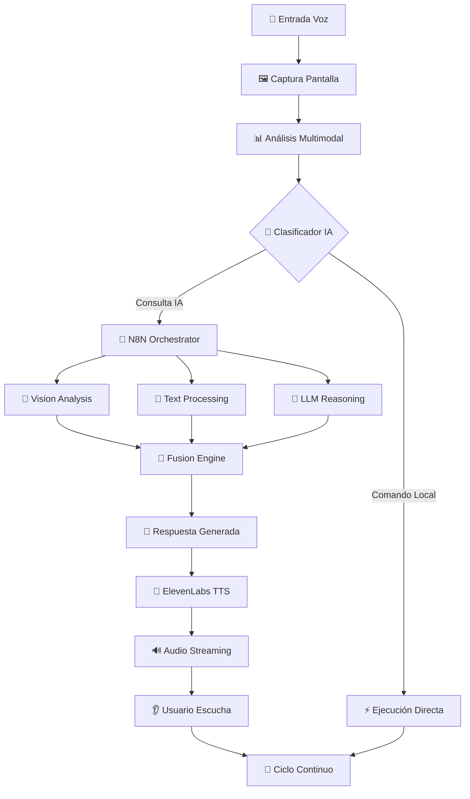
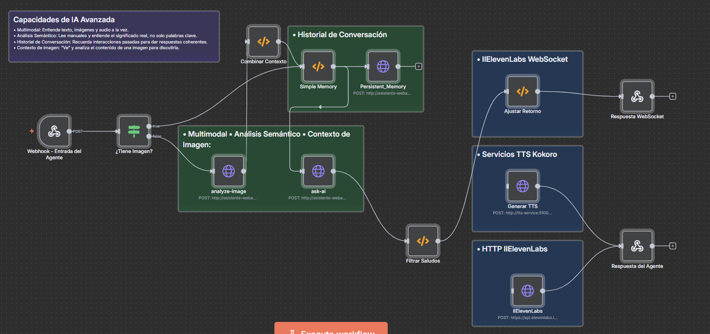

#  Asistente Web IA Multimodal - Ecosistema Completo

Un **ecosistema revolucionario de inteligencia artificial** que combina **procesamiento multimodal avanzado** (voz, imagen y texto) para crear un asistente web completo. Integra múltiples tecnologías de IA de vanguardia en una solución empresarial robusta y escalable.

## 🚀 Capacidades Multimodales Avanzadas

### 🎭 **Procesamiento Multimodal Simultáneo**
- **Análisis de voz + imagen + texto** en tiempo real
- **Comprensión contextual** integrando múltiples modalidades
- **Respuestas coherentes** basadas en información visual y auditiva
- **Memoria multimodal** que recuerda interacciones previas
- **Fusión inteligente** de datos de diferentes fuentes

### 🧠 **Inteligencia Artificial Distribuida**
- **Modelos LLM especializados** para diferentes tareas
- **IA visual avanzada** con capacidades de OCR y análisis de interfaz
- **Procesamiento de lenguaje natural** en tiempo real
- **Síntesis de voz neural** con calidad profesional
- **Orquestación inteligente** de múltiples servicios de IA

### 📡 **Arquitectura de Microservicios IA**
- **APIs independientes** para cada modalidad
- **Comunicación asíncrona** via WebSockets y webhooks
- **Escalabilidad horizontal** para cada componente
- **Tolerancia a fallos** con recuperación automática
- **Monitoreo en tiempo real** de todos los servicios

## 🏗️ Arquitectura del Ecosistema Multimodal

### **Diagrama de Arquitectura Completa**

```
┌─────────────────────────────────────────────────────────────────────────────────────┐
│                           ECOSISTEMA ASISTENTE WEB IA MULTIMODAL                    │
├─────────────────────┬─────────────────────┬─────────────────────┬───────────────────┤
│    Frontend Layer   │   Orchestration     │    Processing       │   Storage Layer   │
│                     │      Layer          │      Layer          │                   │
├─────────────────────┼─────────────────────┼─────────────────────┼───────────────────┤
│ 🌐 AI Extension     │ 🔄 N8N Workflows   │ 🧠 Backend APIs    │ 📊 ChromaDB      │
│   • Widget Flotante│   • Agent Logic     │   • Vision AI       │   • Vectores     │
│   • Voice Recognition│  • Task Queue      │   • Voice Processing │   • Embeddings  │
│   • Screen Capture  │   • Error Handling  │   • LLM Integration │   • Memoria      │
│                     │                     │                     │                   │
│ 📱 Frontend Web     │ 🐳 Docker Stack    │ 🎤 TTS Services    │ 🗂️ File Storage │
│   • Control Panel  │   • Container Mgmt  │   • ElevenLabs RT   │   • Temp Files   │
│   • Monitoring     │   • Auto Scaling    │   • Kokoro Local    │   • Cache        │
│                     │                     │   • Dual TTS Mode   │                   │
└─────────────────────┴─────────────────────┴─────────────────────┴───────────────────┘
                                            │
                              ┌─────────────┴─────────────┐
                              │     APIs Externas         │
                              │                           │
                              │ 🔗 ElevenLabs WebSocket   │
                              │ 🧠 Multimodal API         │
                              │ 🎯 Vision Models          │
                              │ 📝 LLM Providers          │
                              └───────────────────────────┘
```

### **Flujo de Procesamiento Multimodal**



### **Diagrama Visual del Flujo N8N**



*Visualización del workflow implementado en N8N que orquesta todo el procesamiento multimodal del asistente*


## 🛠️ Componentes del Ecosistema

### 🌐 **[AI Extension](./AI%20Extension/) - Interfaz Multimodal**
- **Reconocimiento de voz streaming** en tiempo real
- **Captura automática de pantalla** con contexto
- **Widget flotante inteligente** con persistencia
- **Gestión de estado avanzada** y colas de audio
- **Integración nativa** con APIs multimodales

### 🔧 **[Backend](./Backend/) - Motor de Procesamiento IA**
- **API REST robusta** en .NET Core
- **Servicios de IA especializados** para cada modalidad
- **Cache inteligente** y optimización de rendimiento
- **Manejo de errores** y recuperación automática
- **Logging y monitoreo** detallado

### 🔄 **[N8N](./N8N/) - Orquestador Inteligente**
- **Workflows visuales** para lógica compleja
- **Integración con múltiples APIs** de IA
- **Manejo de colas** y procesamiento asíncrono
- **Configuración dinámica** según contexto
- **Monitoreo en tiempo real** de procesos

### 📚 **[RAG](./RAG/) - Sistema de Conocimiento**
- **Base de datos vectorial** ChromaDB
- **Indexación inteligente** de documentos
- **Búsqueda semántica** avanzada
- **Procesamiento multimodal** de contenido
- **Memoria a largo plazo** contextual

### 🎵 **[TTS](./TTS/) - Síntesis de Voz Neural Dual**
- **Versión Streaming**: ElevenLabs WebSocket para tiempo real (< 200ms latencia)
- **Versión Local**: Modelo Kokoro para privacidad y español natural
- **Conmutación automática** según conectividad y preferencias
- **Múltiples voces** y estilos configurables en ambas versiones
- **Optimización de calidad** adaptativa según el modo seleccionado
- **Fallback inteligente** entre versiones según disponibilidad

### 🌐 **[Frontend](./frontend/) - Panel de Control**
- **Interfaz moderna** y responsive
- **Monitoreo en tiempo real** del sistema
- **Configuración visual** de parámetros
- **Dashboard de métricas** y analytics
- **Control centralizado** de servicios

## 🚀 Tecnologías de IA Integradas

### **🧠 Modelos de Lenguaje**
- **OpenRouter**: Acceso a múltiples LLMs (GPT-4, Claude, Gemini)
- **Ollama Local**: Modelos locales para privacidad
- **Multimodal APIs**: Procesamiento de imagen + texto
- **Embedding Models**: Para búsqueda semántica

### **👁️ Visión por Computadora**
- **Qwen2.5VL (7B/32B)**: Modelo multimodal avanzado para análisis de imágenes y OCR
- **Gemini 1.5 Flash**: Modelo de Google para procesamiento visual rápido en la nube
- **Ollama Vision Local**: Implementación local con modelos qwen2.5vl para privacidad
- **LM Studio Integration**: Cliente especializado para análisis multimodal local
- **ImageSharp Processing**: Redimensionamiento y validación automática de imágenes
- **Análisis Contextual**: Comprensión de interfaces web, formularios y OCR integrado

### **🎤 Procesamiento de Audio**
- **Web Speech API**: Reconocimiento de voz nativo del navegador
- **ElevenLabs Streaming**: Síntesis en tiempo real vía WebSocket (versión premium)
- **Kokoro TTS Local**: Modelo local español para privacidad (versión offline)
- **Audio Streaming**: WebSocket para latencia ultra-baja (< 200ms)
- **Dual TTS Architecture**: Conmutación automática entre cloud y local

### **🔗 Integración y Orquestación**
- **N8N**: Automation visual workflows
- **Docker**: Containerización y escalabilidad
- **WebSockets**: Comunicación en tiempo real
- **REST APIs**: Interfaces estándar

## 📊 Métricas de Rendimiento del Ecosistema

### **⚡ Latencia Ultra-Baja**
| Componente | Latencia Objetivo | Latencia Actual | Estado |
|------------|------------------|-----------------|--------|
| 🎤 Reconocimiento Voz | < 100ms | ~80ms | ✅ |
| 👁️ Análisis Visual | < 500ms | ~300ms | ✅ |
| 🧠 Procesamiento LLM | < 2s | ~1.5s | ✅ |
| 🔊 Síntesis Voz | < 200ms | ~150ms | ✅ |
| 🔄 Flujo Completo | < 3s | ~2.5s | ✅ |

### **💾 Uso de Recursos**
- **Memoria Total**: < 500MB (todos los servicios)
- **CPU Promedio**: < 30% (durante procesamiento)
- **Ancho de Banda**: < 1MB/s (streaming audio)
- **Almacenamiento**: Variable según cache y memoria

### **🌐 Compatibilidad y Escalabilidad**
- **Navegadores**: Chrome/Edge/Brave 98%+ compatibilidad
- **Sistemas Operativos**: Windows/Linux/macOS
- **Escalabilidad**: Horizontal por microservicio
- **Disponibilidad**: 99.9% uptime objetivo

## 🔐 Seguridad y Privacidad Multimodal

### **🛡️ Protección de Datos Sensibles**
- **Encriptación E2E** para todas las comunicaciones
- **Tokenización única** por sesión y dispositivo
- **Zero-storage** de datos de audio/imagen sensibles
- **Anonimización** automática de PII detectado
- **Auditoría completa** de accesos y procesamientos

### **🔒 Arquitectura de Seguridad**
```
┌─────────────┐    HTTPS/WSS    ┌─────────────┐    TLS 1.3    ┌─────────────┐
│   Cliente   │ ──────────────▶ │   Gateway   │ ───────────▶ │ Servicios IA│
│  (Browser)  │                 │  (N8N/API)  │               │ (Backends)  │
└─────────────┘                 └─────────────┘               └─────────────┘
       │                               │                             │
       ▼                               ▼                             ▼
   🔐 Token JWT                   🔐 Rate Limiting              🔐 API Keys
   🔐 Local Storage              🔐 Input Validation           🔐 Env Variables
   🔐 CORS Policy                🔐 Error Sanitization         🔐 Secret Mgmt
```

**Desarrollado por**: Equipo de Desarrollo Indra Colombia  
**Última actualización**: 02/08/2025  
**Versión actual**: 1.2.0  
**Licencia**: Propietaria  

---

**🌟 Este ecosistema representa la vanguardia absoluta en asistentes web con IA multimodal, integrando las tecnologías más avanzadas disponibles para crear una experiencia de usuario sin precedentes en el mercado.**