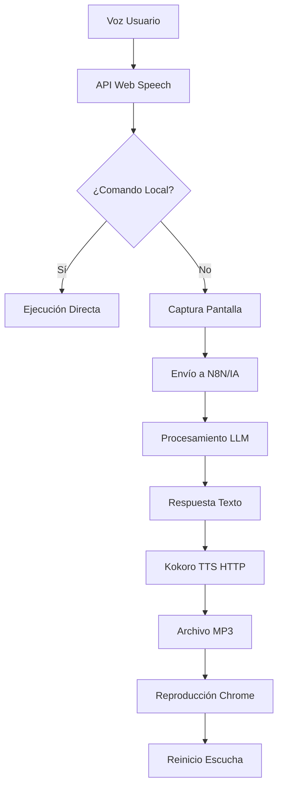

#  Extensión IA - Asistente Web Inteligente

Una **extensión de navegador revolucionaria** que integra múltiples tecnologías de **Inteligencia Artificial** para crear un asistente web completamente autónomo con capacidades de **reconocimiento de voz en tiempo real**, **análisis visual avanzado** y **síntesis de voz streaming**.

## 🚀 Características Principales de IA

### 🎙️ **Reconocimiento de Voz Streaming en Tiempo Real**
- **Detección continua de voz** con Web Speech API nativa
- **Procesamiento inmediato** de comandos sin necesidad de botones
- **Detección inteligente de pausas** para optimizar la respuesta
- **Calidad adaptativa** según la conexión de red
- **Filtros de ruido avanzados** con cancelación de eco y supresión de ruido
- **Soporte multi-idioma** con preferencia español (es-ES)

### 🔊 **Síntesis de Voz con Kokoro TTS**
- **Integración con Kokoro TTS** a través de webhook HTTP
- **Reproducción directa** de archivos MP3 generados por N8N
- **Calidad de audio natural** con modelo Kokoro de alta fidelidad
- **Configuración adaptativa** de velocidad y tono de voz
- **Formato MP3 estándar** generado por N8N/Kokoro TTS
- **Reproducción nativa** con elemento HTML audio de Chrome

### 👁️ **Análisis Visual Avanzado**
- **Captura automática de pantalla** al activar comandos de voz
- **Procesamiento con IA visual** para contexto de la página
- **Detección de elementos de interfaz** (formularios, botones, campos)
- **OCR integrado** para lectura de texto en imágenes
- **Análisis de diseño** para navegación inteligente

### 🧠 **Procesamiento de Lenguaje Natural (PLN)**
- **Clasificación automática de comandos** (locales vs. IA)
- **Comprensión contextual** basada en el contenido visual
- **Ejecución de herramientas locales** para tareas comunes
- **Integración con modelos LLM** a través de N8N/OpenRouter
- **Memoria conversacional** persistente

## 🏗️ Arquitectura Técnica

### **Componentes de la Extensión**

```
┌─────────────────────────────────────────────────────────────┐
│                   Extensión IA                              │
├─────────────────────┬─────────────────────┬─────────────────┤
│   Script Contenido │   Script Fondo      │   Script Popup  │
│   (content.js)      │   (background.js)   │   (popup.js)    │
├─────────────────────┼─────────────────────┼─────────────────┤
│ • Reconocimiento Voz│ • Gestor HTTP       │ • Panel Control │
│ • Análisis Visual   │ • Orquestación API  │ • Configuración │
│ • Automatización UI │ • Streaming Audio   │ • Monitor Estado│
│ • Gestión Widget    │ • Comunicación Tabs │ • Acciones Rápidas │
└─────────────────────┴─────────────────────┴─────────────────┘
                              │
                    ┌─────────┴─────────┐
                    │   APIs Externas   │
                    │                   │
                    │ • Webhook N8N     │
                    │ • Kokoro TTS      │
                    │ • Multimodal API  │
                    │ • ChromaDB        │
                    └───────────────────┘
```

### **Flujo de Procesamiento de IA**



## 🛠️ Tecnologías de IA Integradas

### **1. API Web Speech - Reconocimiento de Voz**
```javascript
// Configuración avanzada del reconocimiento
recognition = new SpeechRecognition();
recognition.lang = 'es-ES';
recognition.interimResults = true;
recognition.maxAlternatives = 1;
recognition.continuous = true;

// Configuración de audio optimizada
navigator.mediaDevices.getUserMedia({ 
  audio: {
    echoCancellation: true,
    noiseSuppression: true,
    autoGainControl: true,
    sampleRate: 44100
  } 
});
```

### **2. Integración HTTP con Kokoro TTS**
```javascript
// Configuración HTTP para síntesis de voz
const payload = {
  UserText: userText.trim(),
  imageBase64: base64Image || '',
  emotion: "calmado",
  ApiKey: userToken
};

// Envío a N8N con Kokoro TTS
const response = await fetch(N8N_WEBHOOK_URL, {
  method: 'POST',
  headers: {
    'Content-Type': 'application/json',
    'Accept': 'audio/mpeg'
  },
  body: JSON.stringify(payload)
});

// Recibir archivo MP3 y reproducir
const audioBlob = await response.blob();
const audioUrl = URL.createObjectURL(audioBlob);
audioPlayer.src = audioUrl;
await audioPlayer.play();
```

### **3. API Chrome Extensions - Captura Visual**
```javascript
// Captura de pantalla con contexto
chrome.tabs.captureVisibleTab(window.id, {
  format: 'jpeg', 
  quality: 70
}, function(dataUrl) {
  // Procesamiento con IA visual
  processImageWithAI(dataUrl);
});
```

## 📋 Funcionalidades Inteligentes

### **🎯 Comandos de Voz Avanzados**

#### **Herramientas Locales (Ejecución Instantánea)**
- `"Escribe [texto]"` - Autocompletado inteligente de formularios
- `"Selecciona [opción]"` - Navegación inteligente en menús desplegables
- `"Siguiente campo"` - Movimiento automático entre campos
- `"Enviar formulario"` - Detección y envío automático
- `"Elimina espacios"` - Limpieza automática de campos

#### **Consultas con IA (Procesamiento Completo)**
- Preguntas contextuales sobre el contenido visual
- Análisis de documentos y formularios
- Sugerencias de autocompletado inteligente
- Explicaciones de interfaces complejas
- Asistencia en navegación web

### **🔄 Gestión Inteligente de Estado**

```javascript
// Sistema de reproducción de archivos MP3
let isRequestActive = false;
let isAudioPlaying = false;
let isProcessing = false;

// Gestión de archivos MP3 desde N8N
async function playAudioFromArrayBuffer(arrayBuffer) {
  const audioBlob = new Blob([arrayBuffer], { type: 'audio/mpeg' });
  const audioUrl = URL.createObjectURL(audioBlob);
  audioPlayer.src = audioUrl;
  await audioPlayer.play();
}
```

### **🎨 Interfaz Flotante Inteligente**

- **Widget arrastrable** con persistencia de posición
- **Indicadores visuales** de estado del procesamiento de IA
- **Ondas de audio animadas** durante síntesis de voz
- **Retroalimentación en tiempo real** del reconocimiento de voz
- **Adaptación responsiva** a diferentes resoluciones

## 🔧 Configuración e Instalación

### **Requisitos Técnicos**
- **Navegador**: Chrome/Edge/Brave (Manifest V3)
- **Permisos**: Micrófono, captura de pantallas, almacenamiento
- **APIs Externas**: Kokoro TTS, N8N, OpenRouter
- **Conectividad**: HTTP/HTTPS para archivos MP3

### **Instalación en Modo Desarrollador**

1. **Clonar y configurar**:
```bash
git clone https://github.com/leherreraSkillChallenge/AI-Extension.git
cd "AI Extension"
```

2. **Cargar en Chrome**:
   - Abrir `chrome://extensions/`
   - Activar "Modo de desarrollador"
   - Hacer clic en "Cargar extensión sin empaquetar"
   - Seleccionar la carpeta `AI Extension`

3. **Configurar APIs**:
   - Configurar webhook N8N con Kokoro TTS
   - Actualizar URLs en `manifest.json`
   - Verificar conectividad HTTP

### **Estructura de Archivos**

```
AI Extension/
├── 📄 manifest.json         # Configuración Manifest V3
├── 🎯 content.js            # Script principal (1500+ líneas)
├── 🔧 background.js         # Service Worker HTTP
├── 🎮 popup.js              # Panel de control
├── 🎨 floating-widget.css   # Estilos del widget flotante
├── 🖼️ icon128.png           # Iconos múltiples resoluciones
├── 📱 index.html            # Interfaz popup
└── 🎨 style.css             # Estilos generales
```

## 🚀 Rendimiento y Optimización

### **Optimizaciones de IA**
- **Detección de pausa inteligente**: 800ms para respuesta ultra-rápida
- **Reproducción MP3 directa**: Archivos de audio completos desde N8N
- **Calidad adaptativa**: Tiempos de espera dinámicos según velocidad de conexión
- **Caché inteligente**: Reutilización de configuraciones y tokens
- **Limpieza automática**: Gestión de memoria para sesiones largas

### **Métricas de Rendimiento**
- ⚡ **Tiempo de respuesta**: < 3 segundos (conexión rápida)
- 🎙️ **Latencia de voz**: < 100ms (reconocimiento)
- 🔊 **Inicio de audio**: < 800ms (descarga MP3)
- 💾 **Uso de memoria**: < 50MB promedio
- 🌐 **Compatibilidad**: 95%+ navegadores modernos

## 🔐 Seguridad y Privacidad

### **Protección de Datos**
- **Tokens únicos** por máquina usando `crypto.randomUUID()`
- **Transmisión cifrada** (HTTPS únicamente)
- **Sin almacenamiento local** de audio o imágenes sensibles
- **Limpieza automática** de URLs temporales
- **Validación de entrada** contra inyección de código

### **Permisos Reales**
```json
{
  "permissions": ["tabs", "activeTab", "storage", "scripting"],
  "host_permissions": ["<all_urls>"],
  "background": {
    "service_worker": "background.js"
  }
}
```
**🌟 Esta extensión representa el estado del arte en asistentes web con IA, combinando reconocimiento de voz en tiempo real, análisis visual avanzado y síntesis de voz con Kokoro TTS para crear una experiencia de usuario verdaderamente revolucionaria.**
